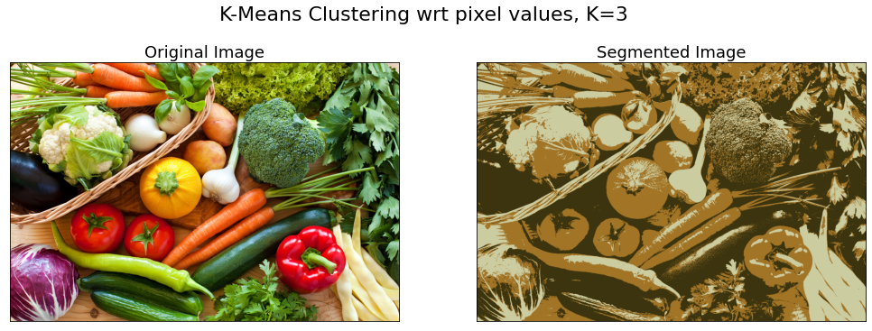
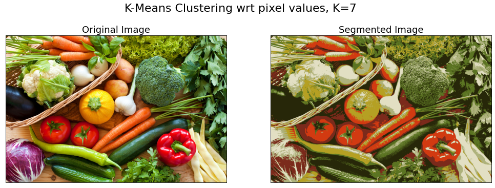
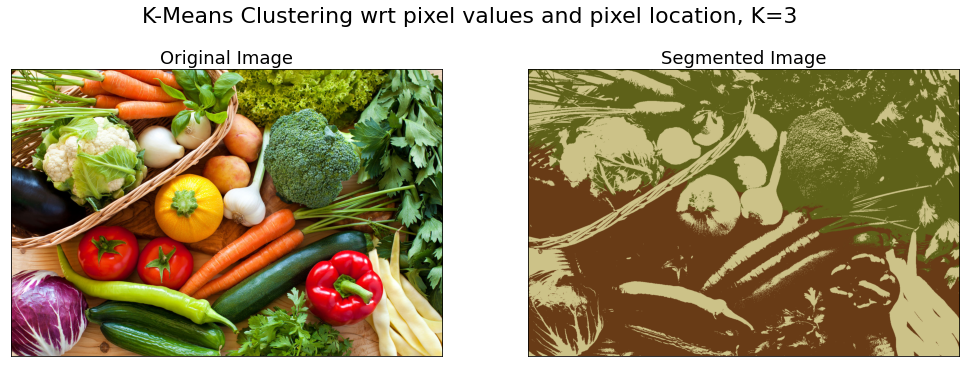
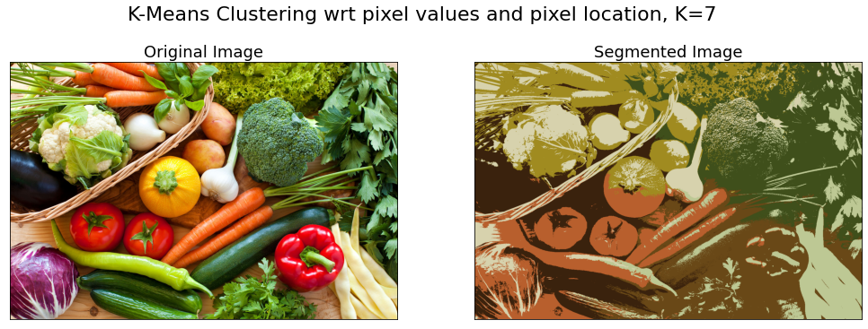

# K-Means based image segmentation

K-means is a well-known clustering algorithm which partitions the data points according to the value of K. It can also be applied to images which can act as a segmentation technique. The goal of
segmentation is to partition an image into regions each of which has a reasonably
homogeneous visual appearance or which corresponds to objects or parts of objects
(Forsyth and Ponce, 2003). 

Here, as a part of an assignment, I have implemented K-Means clustering, from scratch, on an image in two ways -

## 1. Considering only pixel color values as features

In this case, each pixel in an image is considered as a point in a 3-dimensional space
comprising the intensities of the red, blue, and green channels, and the
algorithm simply treats each pixel in the image as a separate data point. The file `segmentation_pixels.py` executes the code. 
Here are results for some values of K -

  
  

## 2. Considering both pixel colors and their locations as features

The previous approach is not a particularly sophisticated approach
to image segmentation, because it takes no account of the spatial proximity
of different pixels. Hence, inorder to also consider the location of pixels, I prepared a 5 dimensional data, consisting of x and y coordinates of a pixel along with its 
rgb values. Also, I rescaled the pixel locations in the range of 0 to 255, same as that of rgb values. The code is contained in the file `segmentation_loc_pixels.py`. Results for some values of K are -

  
  

